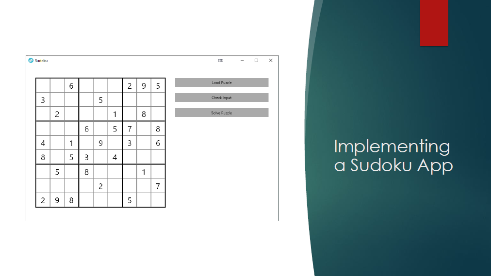

# SudokuPlayground
Some sample code related to Sudoku to test the Avalonia UI Framework

project page: http://avaloniaui.net

## how to run on linux

- install dot net core 2.0+
- install git

clone the repo local 

start the UI using the following command

```
cd ~<pathToYourRepo>/src/AvaloniaMvvmAppUI
dotnet run AvaloniaMvvmAppUI.csproj
```

## Presentation

[PDF](./doc/Avalonia%20UI%20-%20A%20short%20introduction.pdf) | [PowerPoint](./doc/Avalonia%20UI.pptx)

